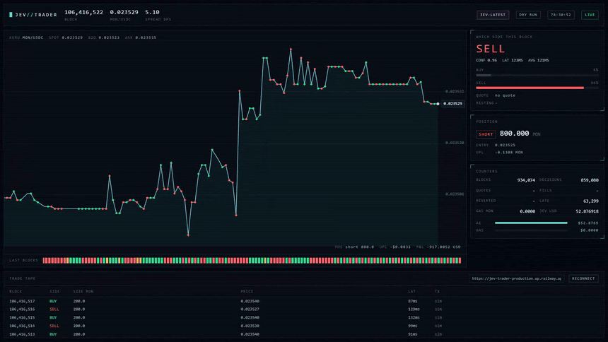

# jev-trader

每个 Monad 区块做一次决策。一个 TypeSafe Jev 模型盯住 Kuru 上的 MON-USDC 订单簿，每约 300 毫秒回答一次买还是卖。每个区块都在该方向挂一笔真实的 post-only 限价单，价格落在最优报价内侧一个 tick 的位置，同时撤掉上一笔。成交发生在别人来吃我们挂单的时候，所以机器人赚的是点差，而不是付点差。一个小型服务端把每个区块推送到看板。

## 看板

`dashboard/index.html` 就是整个前端：一个文件，没有构建步骤，没有依赖。它打开服务端的 SSE 流，逐个区块渲染。

上图是一次真实 dry run 的录制，跑的是 Jev 模型，数据来自已部署的实例。顶栏显示区块号、中间价和点差。下方价格线标出了每一笔成交，色块条是最近 160 个区块（绿色买入，红色卖出，琥珀色表示模型错过了这个区块）。右侧是当前区块的判断及其置信度、持仓、累计计数、AI 花费与链上 gas 的对比，以及成交流水。

    dashboard/index.html                          # 同源，否则用 localhost:3000
    dashboard/index.html?api=https://example.com  # 任何提供 /events 的主机

可以直接从磁盘打开，也可以和服务端一起托管。地址会记在 `localStorage` 里。如果什么都连不上，它会在 3.5 秒后回退到 DEMO 数据源，并在顶栏写明原因，所以页面永远不会空着。

[1600x900 MP4，2.4 MB](docs/dashboard.mp4)

## 运行

    cp .env.example .env
    bun install
    bun run start

没有 `PRIVATE_KEY` 时就是 dry run：真实盘口、真实决策、模拟成交。把 `MODEL=jev` 和 `TYPESAFE_AI_API_KEY` 设好就会用 Jev；默认的 `mock` 是一个用动量启发式顶替的替身。

## 接口

已部署（dry run，Jev 模型）：https://jev-trader-production.up.railway.app

- `GET /` 快照：模型、钱包、dryRun、最新区块事件
- `GET /history` 最近 1000 个区块事件
- `GET /events` SSE：连接时先发一次 `snapshot`，之后每个区块发一个 `block` 事件，另外每当一笔在途订单的回执到达时发一个 `fill` 事件

每个事件的形状（类型定义见 `src/trader.ts`）：

    {
      "block": 105488269, "ts": 1789593630676,
      "mid": 0.022636, "bestBid": 0.022628, "bestAsk": 0.022644, "spreadBps": 7.07,
      "decision": { "action": "buy", "probabilities": { "buy": 0.77, "sell": 0.23, "hold": 0 }, "upIn10": 0.77, "latencyMs": 81, "late": false },
      "quote": { "side": "buy", "price": 0.022629, "size": 200, "txHash": "0x…", "gasMon": 0.0357, "cancel": [100295801], "status": "sent", "orderId": null, "capped": false },
      "fill": null,
      "resting": { "bidMon": 200, "askMon": 200 },
      "position": { "side": "short", "size": 200, "entryPrice": 0.022633, "unrealizedUsd": -0.0006, "unrealizedMon": -0.027 },
      "totals": { "blocks": 3, "decisions": 3, "quotes": 3, "fills": 1, "reverted": 0, "lateBlocks": 0, "jevUsd": 0.000004, "gasMon": 0.107, "gasUsd": 0.0024, "realizedUsd": 0, "pnlUsd": -0.003, "pnlMon": -0.13, "pnlPct": -0.003 }
    }

每个区块都会问模型 `HORIZON_BLOCKS`（默认 100，约 30 秒）之后的走势，模型回答 `buy` 或 `sell`。`quote` 是该区块挂到订单簿上的单子：在该方向的 `TRADE_SIZE_MON` 规模的 post-only 限价单，价格落在最优报价内侧 `QUOTE_INSIDE_TICKS` 个 tick 处（点差太窄时会收拢到最优报价），并在一次 `batchUpdate` 里同时撤掉此前所有在挂单（`cancel`）。`hold` 只在 `decision.late: true` 时出现，表示模型错过了这个区块，什么都没有挂。当持仓上限（实盘时还有保证金）挡住了某一侧时，单子会改挂到另一侧并带上 `capped: true`，而 `probabilities` 仍然反映模型原本的判断。`resting` 是经过这个区块之后我们已知在簿上的数量。`upIn10` 等于买入概率。

实盘发送是 fire-and-forget 的，所以 `block` 事件携带的是**意图**：`status: "sent"`，`gasMon` 等于 `gasLimit x (最近一次已知 base fee + priority)`。Monad 按 gas 上限收费，所以不管这笔单子最终有没有落链，这就是真实成本。回执会晚一两个区块到达，作为独立的 SSE 事件：

    event: quote
    data: { "block": 105488269, "quote": { …, "status": "placed", "orderId": 100295812, "gasMon": 0.0357 } }

`status` 会变成 `placed`（带 order id）或 `reverted`（交易落链前价格已经穿过我们的报价，或者一笔已撤单此前已经成交）。超过 10 个区块没有回执就是 `lost`。成交不在我们自己的交易里：别人的 taker 单吃到我们的在挂单，那笔 Trade 日志会通过同一条喂给模型的 `eth_getLogs` 轮询送过来。每个有成交的区块会单独发一个 SSE 事件，`position`、`realizedUsd` 和 `fills` 在此时更新：

    event: fill
    data: { "block": 105488271, "fill": { "side": "buy", "size": 200, "price": 0.022629, "txHash": "0x…", "orderId": 100295812, "simulated": false } }

`txHash` 是 taker 那笔交易。在 dry run 中，挂单的 `status` 是 `"sim"`：单子在簿上存活一个区块，然后一笔真实成交打印穿过它的价格，把它吃掉（`simulated: true`）。

## 目录结构

    src/config.ts   环境变量
    src/chain.ts    区块源（WebSocket newHeads 加轮询兜底，只保留最新块），原始 RPC
    src/book.ts     一次 eth_call 读完订单簿（解 getL2Book，合并 AMM 金库）
    src/market.ts   Kuru：读盘口、手工编码的 batchUpdate（撤单加 post-only 挂单）、保证金存入、本地 nonce、异步确认
    src/model.ts    Model 接口、JevModel（AI SDK experimental_evaluate）、MockModel
    src/trader.ts   主循环：同时只允许一笔在途，迟到即 hold，持仓与盈亏记账
    src/server.ts   Bun.serve：快照、历史、SSE
    dashboard/      整个前端：一个 HTML 文件，一个 SSE 客户端，无构建步骤

## 300 毫秒预算

一次决策加一笔下单必须塞进一个区块，所以热路径只做两次 RPC 往返：一次 `eth_call` 读盘口（公开 RPC 上约 18 毫秒，走 `READ_RPC_URL`），一次 `eth_sendRawTransaction`（走 `RPC_URL`），后者在交易被接受时就返回。路径上没有别的东西：不调 `eth_estimateGas`（Monad 按 gas 上限收费，所以上限写死，或在启动时推导一次），不调 `eth_sendRawTransactionSync`（它会一直阻塞到交易进入 Proposed 状态），也不查 gas 价格（静态 type-2 费率：`MAX_FEE_GWEI` 作为上限，priority 固定 2 gwei，实际价格是 base 加 priority）。回执、费用估算和金库检查都在后续区块上跑，不在热路径里。用 mock 模型做 dry run 实测：读盘口 p50 为 18 毫秒，整个循环 p50 为 100 毫秒（其中 80 毫秒是 mock 的推理替身）。

    bun run scripts/bench-read.ts     # 盘口解码器对比官方 SDK：精确性与延迟
    bun run scripts/dry-encode.ts     # 离线签一笔买和一笔卖，断言 calldata 与 SDK 一致

## 本地运行时满屏 late 是正常的

如果在一台离 Monad 节点较远的机器上本地运行，看板上会看到大片琥珀色的 LATE，成交流水稀疏，`lateBlocks` 长期超过 `blocks` 的一半。这是预期行为，不是 bug。

`late` 的含义是：新区块到达时，上一次的「读盘口加问模型加下单」还没跑完。主循环是单飞且不排队的，所以干一次活超过 300 毫秒的区块间隔，就必然丢掉一部分区块。

在本机实测：读盘口均值 249 ms（文档称约 18 ms），模型推理均值 325 ms（文档称约 100 ms），合计 574 ms，对 302.7 ms 的实测区块间隔。1651 次决策里 **0 次**在 400 ms 内跑完，最终决策率 43.5%。

作为对照，同一份代码、同一个模型部署在离链较近的实例上，late 率是 6.75%，决策率 92.01%。**差别只来自网络位置。** 换一个更快的公开 RPC 解决不了：本机直连 Monad 官方节点，往返中位数就是 303 ms，而每个区块只有约 300 ms。

完整的实测数据、分档分布、以及为什么流水线化不是正确对策，见 [docs/LATENCY.md](docs/LATENCY.md)。

## 换链或者换场所能解决吗

不能。而且币安从这台机器根本连不上。

整个循环里只有两次外部往返，先把它们各自落在哪里定位出来：

| 环节 | 端点 | 位置 | 本机往返中位数 |
|---|---|---|---|
| 读盘口 | `rpc.monad.xyz` | 日本东京 | 303 ms |
| 模型推理 | `api.typesafe.ai` | 美国俄勒冈州 Boardman | 239 ms |

拆开看，这两段耗时几乎全是网络：

| 环节 | 本机总耗时 | 服务端处理 | 网络 |
|---|---|---|---|
| 读盘口 | 249 ms | 约 18 ms 解码 | 约 231 ms |
| 模型推理 | 325 ms | 约 86 ms 推理 | 约 239 ms |

网络合计约 470 ms，占 574 ms 整个循环的 **82%**。**模型那一跳和链那一跳一样贵**，只盯着链是看错了方向。

更关键的是，这台机器到任何国际域名的往返地板就在 220 到 300 ms 之间：

| 端点 | 往返中位数 | 结果 |
|---|---|---|
| 东京，Monad RPC | 303 ms | 200，正常 |
| 俄勒冈，TypeSafe AI | 239 ms | 正常 |
| Hyperliquid 接入点 | 224 ms | 正常 |
| 币安接入点 | 245 ms | TCP 握手成功，HTTP 不返回 |
| 新加坡，GitHub（对照） | 251 ms | 200，正常 |

连 GitHub 都要 251 ms。**没有「更近的场所」这个选项。**

再往下一层看，换场所换掉的是竞争，不是距离：

| 场所 | 结构 | 你要面对什么 |
|---|---|---|
| Monad 加 Kuru | 300 ms 区块的链上订单簿，新兴链，盘口浅 | 竞争稀疏，而且作者在东京，读盘口只要 18 ms |
| Hyperliquid | 官方公布同址客户端的端到端延迟中位数 0.2 秒、p99 约 0.9 秒 | 就算把进程搬到验证者隔壁，一次下单往返也已经吃掉整个 300 ms 预算；做市对手是 HLP 金库和专业做市商 |
| 币安 | 中心化撮合，同机房参与者是亚毫秒级 | 挂单的排队位置直接由延迟决定，你永远排最后，而且本机连不上 |

这个项目能在 Monad 上跑通，靠的不是 Monad 网络快，而是作者人在东京、离 RPC 只有 18 ms，加上 Kuru 是一个竞争稀疏的年轻订单簿。这两条都搬不到别的场所。

真要改善，方向只有一个：**把进程搬到离场所近的地方**。放到东京，链那一跳从 249 ms 降到约 18 ms，循环从 574 ms 降到约 290 ms，刚好进预算；再把模型换成亚洲的推理端点，可以压到约 113 ms。**模型部署的位置和链同等重要。**

跳点定位、测量方法与各端点的完整明细见 [docs/LATENCY.md](docs/LATENCY.md)。
